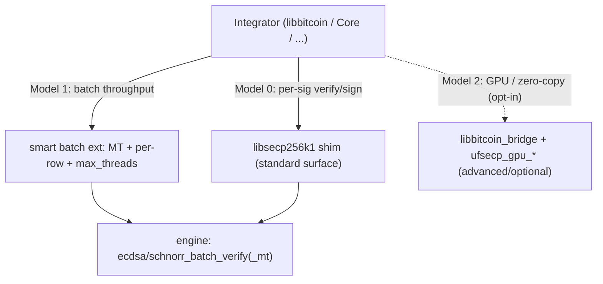

# Integration Models — the bridge-free standard

This document defines the **standard ways to integrate UltrafastSecp256k1** into a consensus
or wallet codebase (libbitcoin, Bitcoin Core, Litecoin, Knots, Dogecoin, …). The goal is one
small, well-understood surface for the common cases and an explicit opt-in tier for advanced
GPU / zero-copy needs — **no bespoke per-integrator bridge required** for CPU throughput.

The single standard surface is the **`libsecp256k1` shim** (`compat/libsecp256k1_shim`), which
is API/ABI compatible with upstream `libsecp256k1`. "Smartness" (engine-managed multi-threading
and per-row results) lives *inside* the shim's batch extension, so integrators get throughput
without managing threads, memory layouts, or device selection themselves.

Install/link policy follows the same split:

- Native engine / shim integrations link `secp256k1::fast` or `secp256k1_shim`.
- `libufsecp` is an optional C ABI / bridge package, not a second mandatory
  engine library.
- The default top-level install emits `libfastsecp256k1` and
  `secp256k1-fast.pc` (`-lfastsecp256k1`). Install `libufsecp` only with
  `-DSECP256K1_BUILD_CABI=ON -DSECP256K1_INSTALL_CABI=ON`.
- CUDA builds default to static CUDA runtime linkage
  (`CMAKE_CUDA_RUNTIME_LIBRARY=Static`), so the engine package does not add a
  runtime `libcudart.so` / `cudart64*.dll` dependency. The NVIDIA driver remains
  a host dependency.



---

## Model 0 — Drop-in (default; already works)

Use the `libsecp256k1` shim exactly like upstream `libsecp256k1`: per-signature
`secp256k1_ecdsa_verify` / `secp256k1_schnorrsig_verify` (and the sign / keypair / pubkey API).

- **Integration code:** none. Link the shim instead of upstream `libsecp256k1`.
- **Covers:** script/interpreter validation in Core, libbitcoin, Litecoin, Dogecoin, Knots.
- **Threads:** none added; identical call shape and result to upstream.

This is the correct model for transaction/script validation, where signatures are verified one
at a time in the interpreter.

---

## Model 1 — Batch throughput (CPU-first; this standard)

For paths that verify **many** signatures at once (IBD, block-level batch validation, mempool
acceptance of large packages), use the shim's **batch extension**
(`compat/libsecp256k1_shim/include/secp256k1_batch.h`). It wraps the engine's first-class
multi-threaded batch verify; the integrator never spawns threads or manages scratch memory.

### API

```c
/* All-or-nothing (auto threads). Returns 1 iff every signature is valid; n==0 => 1. */
int secp256k1_ecdsa_verify_batch(ctx, sigs, msgs32, pubkeys, n);
int secp256k1_schnorrsig_verify_batch(ctx, sigs64, msgs, msglen, pubkeys, n);

/* Explicit thread control. */
int secp256k1_ecdsa_verify_batch_mt(ctx, sigs, msgs32, pubkeys, n, max_threads);
int secp256k1_schnorrsig_verify_batch_mt(ctx, sigs64, msgs, msglen, pubkeys, n, max_threads);

/* Per-row verdicts: results[i] = 1 (valid) / 0 (invalid or malformed). Returns 1 iff all valid. */
int secp256k1_ecdsa_verify_batch_results(ctx, sigs, msgs32, pubkeys, n, max_threads, results);
int secp256k1_schnorrsig_verify_batch_results(ctx, sigs64, msgs, msglen, pubkeys, n, max_threads, results);
```

### `max_threads` contract

| value | meaning | when to use |
|-------|---------|-------------|
| `0`   | auto: `hardware_concurrency()` (no arbitrary upper cap) | one big batch, no caller pool |
| `1`   | serial (no worker threads spawned) | **you already run your own thread pool** — pass `1` to avoid oversubscription |
| `N`   | up to `N` worker threads (reduced only to what the hardware can run) | you want to bound CPU usage |

The boolean ("all valid") result is **identical for any thread count** — threading is a pure
throughput change. Verification is variable-time over **public** data only (pubkey/msg/sig);
there is no secret material and no secret-dependent branch, so there is **zero constant-time
impact** (same class as the engine's `ecdsa_batch_verify_mt`).

### Guarantees

- **No-failure / never throws across the C ABI.** If internal thread creation fails, the call
  falls back to serial verification; the result is deterministic and identical to the serial path.
- **No config files.** The engine self-manages its fixed-base `.bin` cache; point it at a
  directory with `ufsecp_set_cache_dir()` / `SECP256K1_CACHE_DIR` if you don't want CWD. No
  `config.ini` is created or read.
- **Per-row diagnostics in one call.** `_results` tells you exactly which rows failed (including
  malformed inputs), so you don't re-verify individually to find the bad signature.

### Decision guide

- One large batch, library owns the CPU → `..._verify_batch_mt(..., 0)` or the auto wrapper.
- Caller drives many batches from its own pool (e.g. one batch per worker) → pass `max_threads = 1`.
- Need to know which signatures failed → `..._verify_batch_results(..., results)`.

---

## Model 2 — Advanced integrator (optional; GPU / zero-copy)

For integrators that need GPU acceleration or zero-copy packed-row / columnar layouts, the
bespoke `compat/libbitcoin_bridge` (`ufsecp_lbtc_*`) and the `ufsecp_gpu_*` C ABI remain
available. This tier is **opt-in and not required** — most integrators should use Model 1.

- **Covers:** GPU dispatch (CUDA/OpenCL/Metal) with CPU fallback, packed-row/columnar/collect
  verdict buffers, libbitcoin-specific Taproot/BIP-352 helpers.
- **Status:** kept as-is. GPU dispatch *inside* the standard shim AUTO path is a future additive
  step; until then GPU lives here. Even the bridge's CPU ECDSA path can later adopt
  `ecdsa_batch_verify_mt` as a separate optimization.

Install this tier explicitly:

```bash
cmake -S . -B out/install-both -G Ninja -DCMAKE_BUILD_TYPE=Release \
  -DSECP256K1_BUILD_CABI=ON \
  -DSECP256K1_INSTALL_CABI=ON
cmake --build out/install-both --target install
```

That produces both packages: `secp256k1-fast.pc` for the native engine and
`ufsecp.pc` for the optional C ABI / bridge surface.

---

## Summary

| | Model 0 | Model 1 | Model 2 |
|---|---|---|---|
| Surface | shim per-sig | shim batch ext | `libbitcoin_bridge` / `ufsecp_gpu_*` |
| Integration effort | none (drop-in) | small (call batch API) | larger (bridge ABI) |
| Threads | none | engine-managed (`max_threads`) | engine/GPU |
| Per-row results | n/a | yes (`_results`) | yes |
| GPU / zero-copy | no | no | yes |
| Required? | default | recommended for batch | opt-in only |

For a concrete libbitcoin mapping, see [`LIBBITCOIN_INTEGRATION.md`](LIBBITCOIN_INTEGRATION.md).
